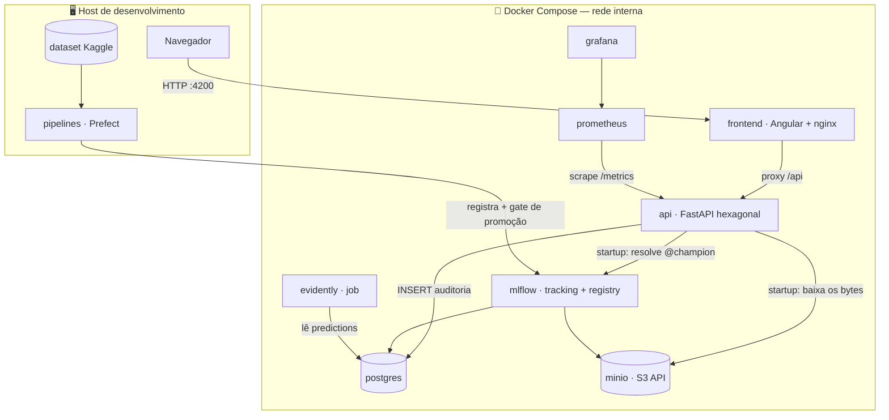

# 🏦 MLOps Credit Risk Platform

[](https://github.com/RafaelRuizSilva/mlops-credit-risk-plataform/actions/workflows/ci.yml)
[](https://rafaelruizsilva.github.io/mlops-credit-risk-plataform/)


Plataforma completa de Machine Learning para **risco de crédito** (dataset [Give Me Some Credit](https://www.kaggle.com/c/GiveMeSomeCredit)), construída com as práticas de engenharia de ML usadas em produção — **rodando 100% grátis** em Docker Compose, com cada peça open-source simulando um serviço da AWS.

> 🔗 **[Demo pública](https://rafaelruizsilva.github.io/mlops-credit-risk-plataform/)** (score calculado no navegador com os coeficientes reais do modelo baseline)
> 🔗 **[Arquitetura interativa](https://rafaelruizsilva.github.io/mlops-credit-risk-plataform/arquitetura.html)** — clique nas peças, siga os fluxos, alterne para o modo AWS

---

## Arquitetura



### Paralelo com a AWS

| Peça local | Papel | Na AWS seria |
|---|---|---|
| MinIO | object storage (artefatos de modelo, data lake) | **S3** |
| MLflow | experiment tracking + model registry (alias `@champion`) | **SageMaker Experiments + Model Registry** |
| PostgreSQL | backend do MLflow + tabela `predictions` (auditoria) | **RDS** |
| Prefect | orquestração do treino com gate de promoção | **SageMaker Pipelines / Step Functions** |
| FastAPI + nginx | serving + proxy mesma-origem | **ECS Fargate + API Gateway / CloudFront** |
| Prometheus + Grafana | métricas operacionais e dashboards | **CloudWatch** |
| Evidently | monitoramento de data drift | **SageMaker Model Monitor** |

## O modelo

| | Baseline (v1) | Champion atual (v3) |
|---|---|---|
| Algoritmo | LogisticRegression (imputação mediana + scaler) | **LightGBM** (NaN nativo) |
| AUC (teste) | 0.858 | **0.866** |
| KS | 0.563 | **0.577** |

- **Gate de promoção**: um modelo novo só recebe o alias `@champion` se superar o atual em AUC de teste — decisão automática do pipeline, não humana. (A v2, retreino do baseline, foi *rejeitada* pelo gate.)
- **Responsible AI em toda run**: beeswarm SHAP global (artefato no MLflow) + métricas Fairlearn de disparidade por faixa etária.
- **Explicação por predição**: `GET /predictions/{id}/explanation` — contribuições por feature em log-odds (coeficiente×feature no modelo linear; TreeSHAP nativo no LightGBM).
- **Validação de dados**: contrato [pandera](ml/src/credit_risk/validation.py) como gate de qualidade antes de qualquer treino.

## A API (arquitetura hexagonal)

```
entrypoints (FastAPI)  →  domínio (stdlib puro)  ←  adapters (MLflow, Postgres)
   rotas + schemas         ScoringService              MLflowModelProvider
   handlers de erro        ExplanationService          PostgresPredictionLogger
                           ports (Protocols)
```

- Domínio sem nenhum import de framework — testável com fakes em milissegundos.
- **Fail-closed**: predição sem registro de auditoria não é respondida.
- Contrato de erros nas ports: adapters traduzem exceções de infra para exceções do domínio (`ModelUnavailableError` → 503, `PredictionNotFoundError` → 404).
- `/health` (liveness) ≠ `/ready` (modelo carregado na memória).
- **37 testes** (unitários com fakes + integração contra a infra real; integração é *pulada* automaticamente sem Docker).

## Como rodar

Pré-requisitos: Docker Desktop, [uv](https://docs.astral.sh/uv/), e o dataset do Kaggle em `ml/data/raw/` (`cs-training.csv`).

```bash
# 1. infra + aplicação completa
cd infra
cp .env.example .env          # ajuste as credenciais locais
docker compose --profile app up -d --build

# 2. treinar e registrar o primeiro champion
cd ../pipelines
uv run python flows/training_flow.py              # baseline logístico
uv run python flows/training_flow.py --model lightgbm   # desafiante c/ gate

# 3. reiniciar a API para carregar o champion
cd ../infra && docker compose --profile app restart api
```

| Serviço | Endereço |
|---|---|
| Aplicação (front) | http://localhost:4200 |
| API + Swagger | http://localhost:8000/docs |
| MLflow | http://localhost:5000 |
| MinIO (console) | http://localhost:9001 |
| Grafana | http://localhost:3000 (admin/admin) |
| Prometheus | http://localhost:9090 |

Dia a dia de dev: `docker compose up -d` (sem profile) sobe só a infraestrutura; API roda no host com `uv run uvicorn credit_risk_api.entrypoints.app:app --reload` e o front com `npm start` (proxy configurado).

Monitoramento de drift (batch): `cd pipelines && uv run python flows/drift_flow.py` → `pipelines/reports/drift_report.html`.

## Estrutura

```
├── ml/           # pacote credit_risk: dados, features, treino, validação, responsible AI
├── api/          # FastAPI hexagonal (domain / adapters / entrypoints) + testes
├── pipelines/    # flows Prefect: treino c/ gate de promoção + drift Evidently
├── frontend/     # Angular 22 + nginx (e modo demo p/ GitHub Pages)
├── infra/        # docker-compose, Dockerfile do MLflow, provisioning Grafana/Prometheus
└── .github/      # CI (lint, testes, builds) + deploy do Pages
```

Cada projeto Python é independente, gerenciado por **uv** (pyproject + lockfile).

## Decisões de arquitetura (e trade-offs assumidos)

- **Feast (feature store) foi deliberadamente cortado**: neste desenho as features chegam completas no request — não existe lookup online que o justifique. O training/serving skew da feature `declarou_renda` está documentado no código como risco conhecido.
- **A API carrega o champion no startup** (predição 100% em memória, <10 ms). Custo: promover um modelo exige restart — reload automático está no roadmap.
- **Features das predições em JSONB**: evolução de schema do modelo sem migração de banco; alimenta o Evidently direto.
- **Label lag**: o target real ("default em 2 anos") só chega no futuro — por isso o monitoramento é de *drift* (proxy), não de acurácia em produção.

### Roadmap / dívidas conhecidas

Alembic para migrações · reload do champion sem restart · agendamento dos flows · métricas do Evidently no Prometheus · calibração das faixas de risco · testes do pacote `ml/`.

---

Projeto de estudo/portfólio — dados do Kaggle não são redistribuídos neste repositório.
